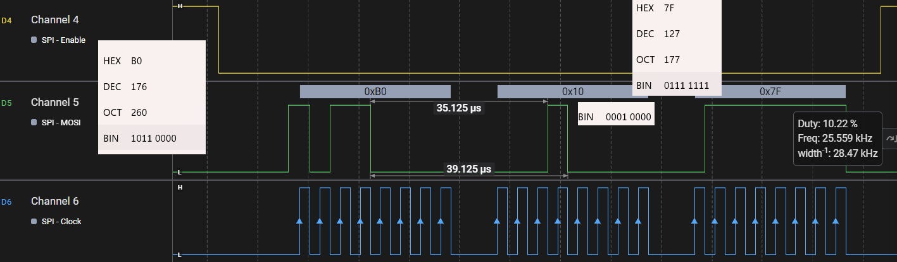
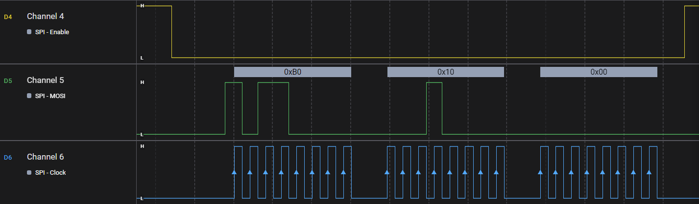

## Architecture proposée

PIC18F45K20 en SPI MAÎTRE communique les messages midi:

Un message de 3 octets :

[TYPE][N°][VALEUR]

Ex: 0xB0 0x10 0x7F → CC 16, Note= 127, Vélocité = 177

RP2040 en SPI ESCLAVE (avec PIO avec micropython, car le RP2040 n’a pas de périphérique SPI esclave hardware).

Les 2 communiquent en 3.3 V.

## Mode SPI utilisé pour le maître
Mode 0 (le plus répendu) => CPOL = 0, CPHA = 0 

CPOL (Clock Polarity) : Détermine si l'horloge est haute ou basse lorsque le périphérique est inactif.

CPHA (Clock Phase) : Détermine à quel moment les données sont échantillonnées par rapport à l'horloge.

## Schéma de connexion SPI — PIC → RP2040
```
┌───────────────────────────┐         ┌──────────────────────┐
│ PIC18F45K20 (SPI Master)  │         │  RP2040 (SPI Slave)  │
├───────────────────────────┤         ├──────────────────────┤
│ RC3 (pin 37) — SCK        ──────────── SPIO (pin 18) SCK   │
│ RC5 (pin 43) — SDO (MOSI) ──────────── SPIO (pin 16) (RX)  │
│ RC6 (pin 44) — GPIO       ──────────── SPIO (pin 17) (CSn) │
│ GND                       ──────────── GND                 │
└───────────────────────────┘         └──────────────────────┘
```
## Analyse des signaux SPI

### Matériel 
CY7C68013A analyseur logique

### Configurer le logiciel Saleae


### Message Midi On


### Message Midi Off

Nombre de bit à lire pour un message midi : 24  (3 * 8 bits).

Donc quand CS_n est bas on lit MISO dès que SCK est à l'état haut. Pour détecter le prochain front montant 
il faut attendre que SCK soit à l'état bas.
## Faisabilité sur le RP2040
Le RP2040 a des limitations sur le mode SPI esclave :
- limité à une fréquence d'horloge de 10 MHz
- les données doivent être traitées rapidement et via des interruptions
- dépendance du SDK
- problèmes reportés de compatibilité des modes SPI

Le top : le programmer avec PIO qui est une sorte de processeur pour créer une interface matériel.

MicroPython supporte PIO.

```
from machine import Pin
from rp2 import StateMachine, asm_pio
import time


# --- PIO Programme ---
@asm_pio(
    in_shiftdir=rp2.PIO.SHIFT_LEFT,
    autopush=True,
    push_thresh=24,  # read 24 bits before passing to the FIFO
)
def spi_slave_read_byte():
    label("waitfall")
    wait(0, pin, 1)  #  CS LOW
    set(x, 23)  # 24 bits à lire
    label("read_bits")
    wait(1, pin, 2)  #  SCK
    in_(pins, 1)  # read 1 bit
    wait(0, pin, 2)  #  SCK
    jmp(x_dec, "read_bits")
    wait(1, pin, 1)  # CS HIGH
    irq(block, 0)  # interruption
    jmp("waitfall")


# --- Configuration PINs ---
PIN_MOSI = 16
mosi = Pin(PIN_MOSI, Pin.IN)


# --- Handler Interruption ---
def on_spi_rx(sm):
    try:
        while sm.rx_fifo():
            data = sm.get()
            status = (data >> 16) & 0xFF
            note = (data >> 8) & 0xFF
            vel = data & 0xFF
            print(f"🎶 MIDI received: Status={hex(status)} Note={note} Velocity={vel}")
    except Exception as e:
        print("❌ Error IRQ:", e)


# --- Initialisation  StateMachine ---
sm = StateMachine(0, spi_slave_read_byte, in_base=mosi, freq=2_000_000)
sm.irq(handler=on_spi_rx)  # Associating handler to l'IRQ
sm.active(1)

print("🎛️ En attente de trames SPI...")

# --- loop  ---
try:
    while True:
        time.sleep(1)  # loop can sleep
except KeyboardInterrupt:
    sm.active(0)
    print("🚪 Clean exit.")


# https://docs.micropython.org/en/latest/library/rp2.StateMachine.html
# https://datasheets.raspberrypi.com/pico/raspberry-pi-pico-python-sdk.pdf


```
